\# whisper.


> \*your private canvas for the noise inside\*


Whisper is a calm, calendar-free mobile journaling app built with Flutter. It is not a productivity tool. It does not push you to write every day. It simply listens — when you need to express something, it's there.


---


\## philosophy


\- \*\*pages, not days\*\* — no calendar pressure, no empty days to feel guilty about

\- \*\*offline-first\*\* — your thoughts belong to you

\- \*\*emotion over productivity\*\* — write, draw, record, listen — whatever captures the moment

\- \*\*silence is allowed\*\* — empty pages are welcome, nothing is mandatory


---


\## features


\- 📓 \*\*notebooks\*\* — organize your whispers into collections

\- 🎨 \*\*freeform canvas\*\* — each whisper is an open space, not a lined page

\- ✍️ \*\*text\*\* — write with custom colors and font sizes

\- 🖊️ \*\*drawing\*\* — pen, pencil, marker, highlighter and eraser

\- 🖼️ \*\*photos\*\* — add and crop images, scale and rotate freely

\- 🎙️ \*\*voice\*\* — record and embed voice notes directly on the canvas

\- 🎵 \*\*music\*\* — attach Spotify, Apple Music or YouTube links as mood cards

\- 🌙 \*\*canvas themes\*\* — 10 background colors to set the mood

\- 📤 \*\*export \& share\*\* — save your whisper as a high-quality image


---


## screenshots

<table>
  <tr>
    <td>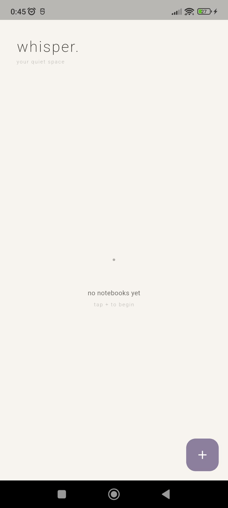</td>
    <td>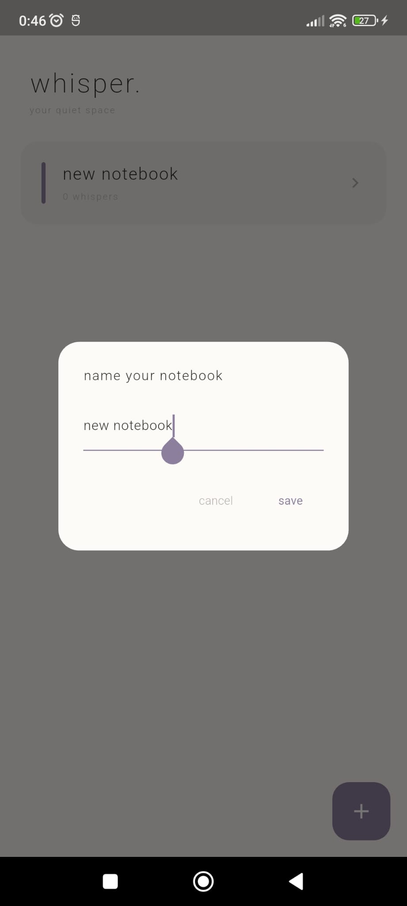</td>
    <td>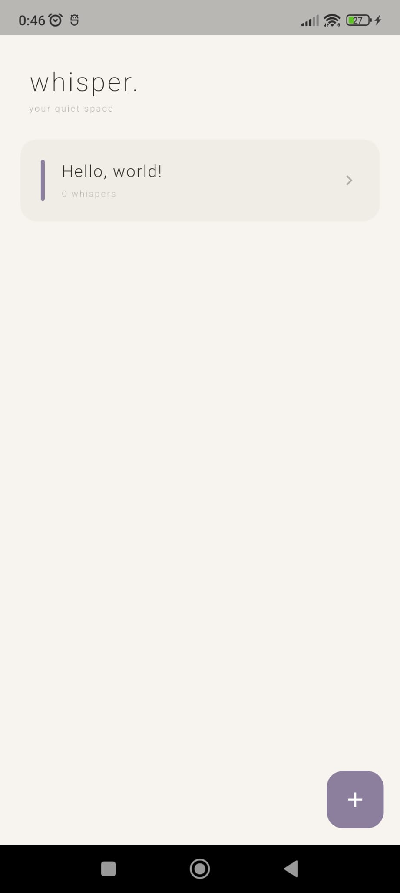</td>
    <td>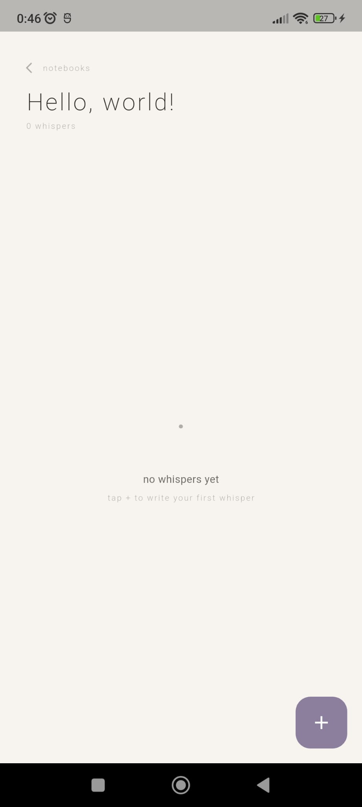</td>
  </tr>
  <tr>
    <td>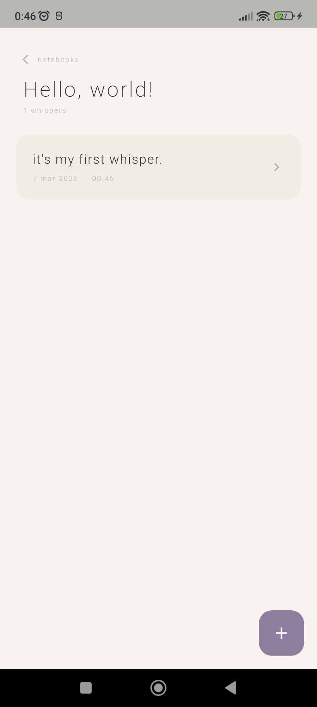</td>
    <td>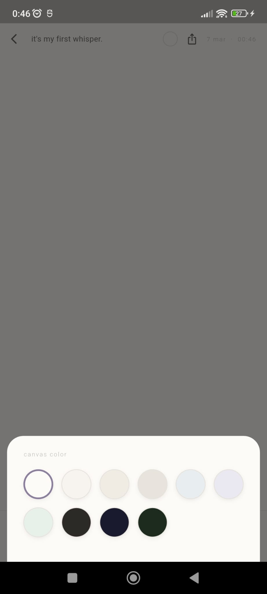</td>
    <td>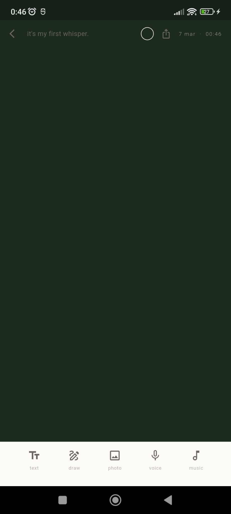</td>
    <td>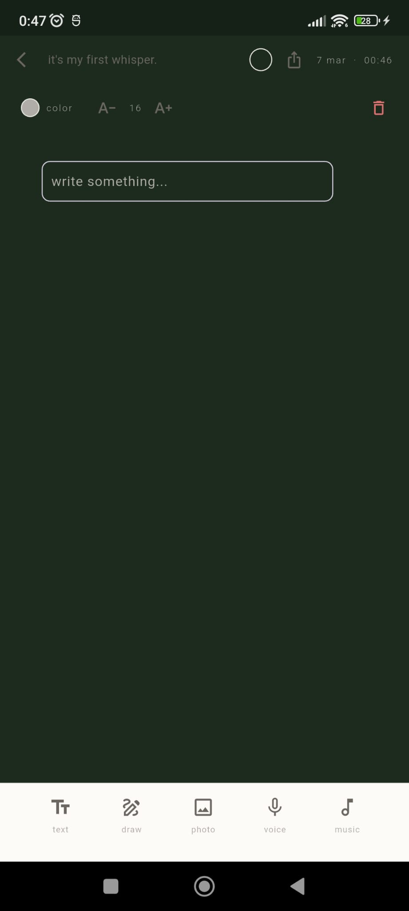</td>
  </tr>
  <tr>
    <td>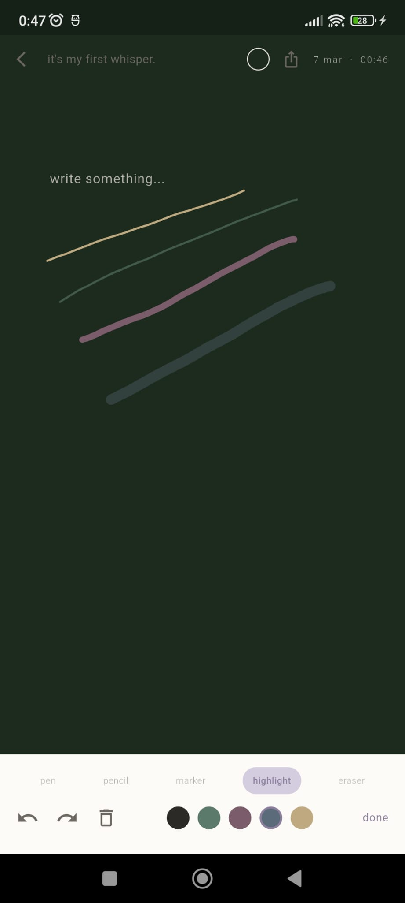</td>
    <td>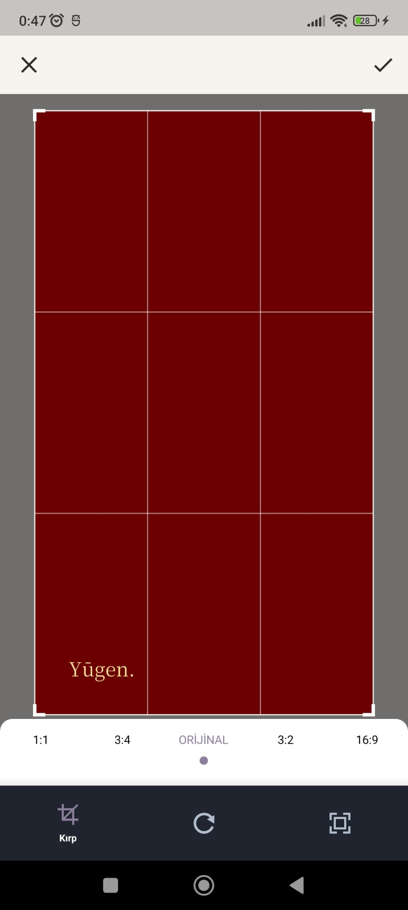</td>
    <td>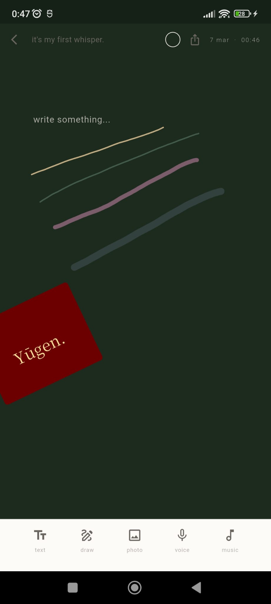</td>
    <td>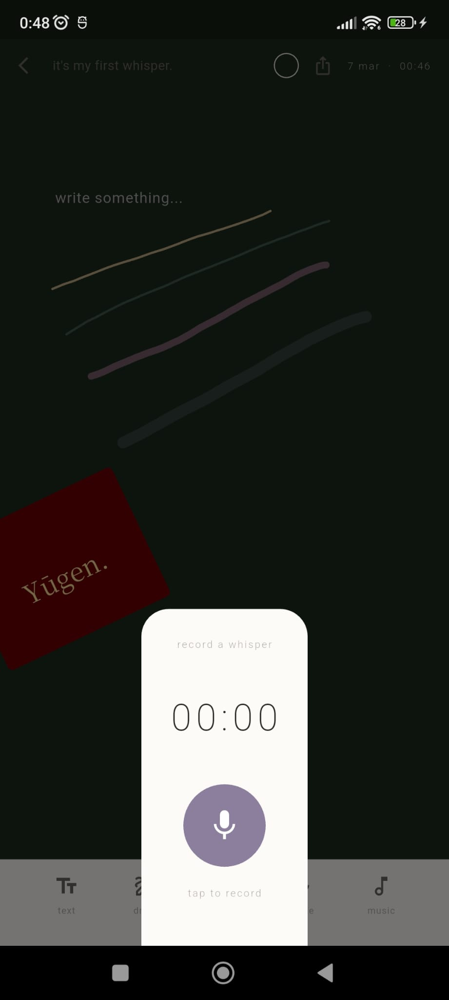</td>
  </tr>
  <tr>
    <td>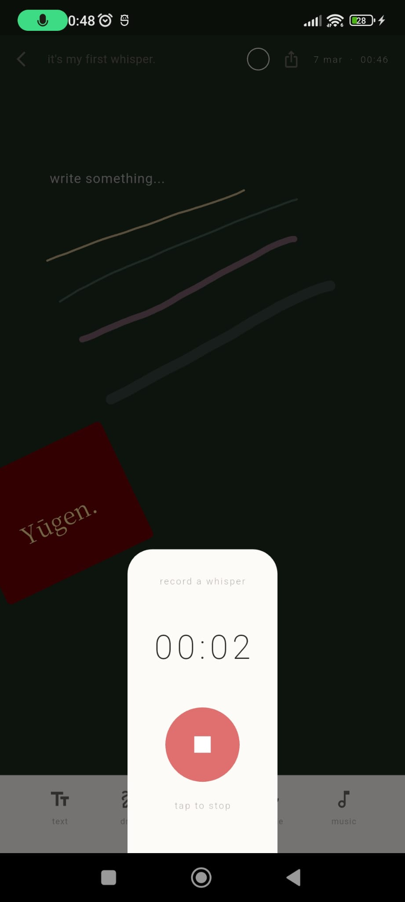</td>
    <td>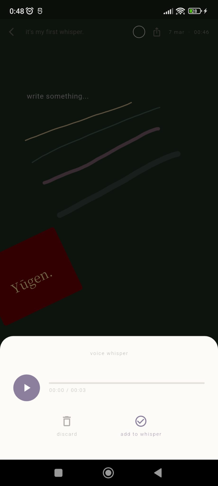</td>
    <td>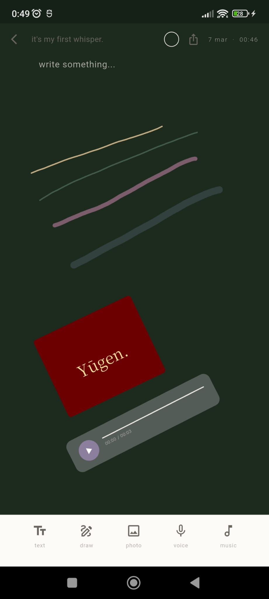</td>
    <td>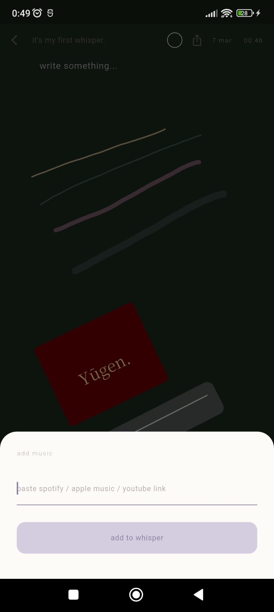</td>
  </tr>
  <tr>
    <td>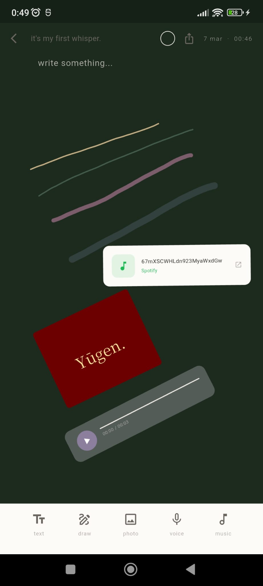</td>
    <td>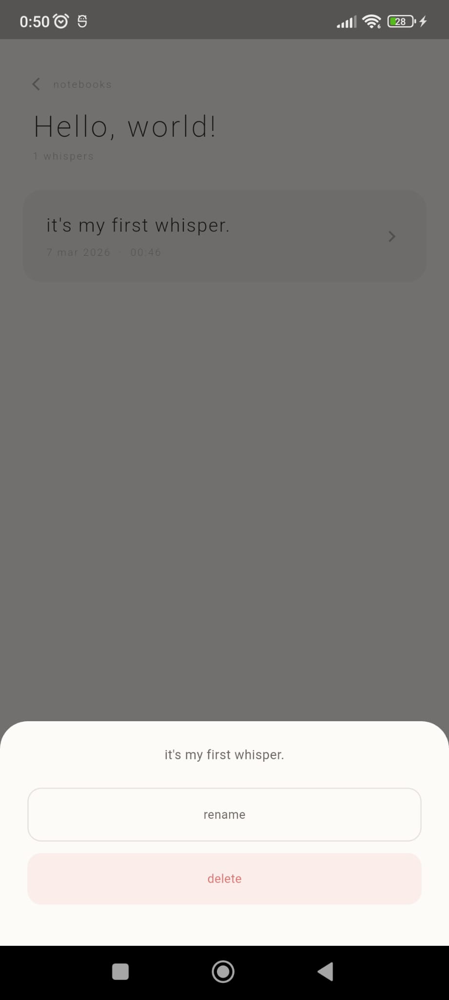</td>
  </tr>
</table>


\## built with


\- \[Flutter](https://flutter.dev)

\- \[just\_audio](https://pub.dev/packages/just\_audio)

\- \[record](https://pub.dev/packages/record)

\- \[image\_picker](https://pub.dev/packages/image\_picker) + \[image\_cropper](https://pub.dev/packages/image\_cropper)

\- \[screenshot](https://pub.dev/packages/screenshot) + \[share\_plus](https://pub.dev/packages/share\_plus)

\- \[shared\_preferences](https://pub.dev/packages/shared\_preferences)

\- \[url\_launcher](https://pub.dev/packages/url\_launcher)


---


\## getting started

```bash

git clone https://github.com/husnabetulpatat/whisper.git

cd whisper

flutter pub get

flutter run

```


> Requires Flutter 3.x · Android SDK 21+ · iOS 13+


---


\## roadmap


\- \[ ] Firebase auth + cloud sync

\- \[ ] Share whispers with friends

\- \[ ] Video support

\- \[ ] Stickers \& custom fonts


---


\## license


MIT

